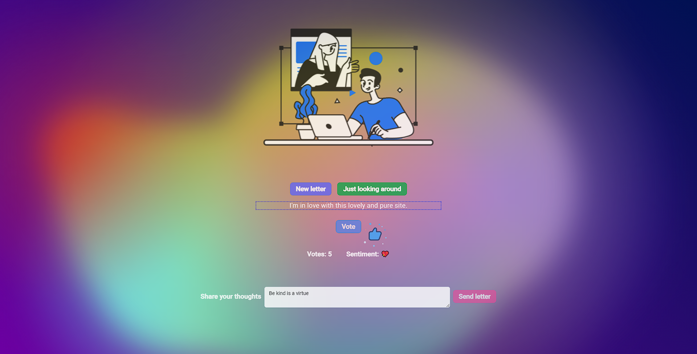

# Kind Words

## Table of Contents

- [Introduction](#introduction)
- [Usage](#usage)
- [Screenshot](#screenshot)
- [Features](#features)
- [Observations](#bservations)
- [Contact](#contact)

## Introduction

The purpose of this project was to understand how Lottie animations can be used in Angular, learn NoSQL logic (especially with MongoDB), and experiment with the Bun runtime (now it can handle Tensorflow). Kind Words is a basic landing page ([background idea](https://www.youtube.com/watch?v=Ml-B-W91gtw&t=1s)) created with Angular 17 and connected to a CRUD API developed with Elysia to manage a collection of anonymous letters via Mongo Atlas.
<br></br>
<b>Current state: finished</b>

## Usage

```bash
ng serve
# and
bun run dev
```

Open [http://localhost:4200](http://localhost:4200) with your browser to see the result.

## Screenshot



## Features

- [x] Limit API calls
- [x] Validate headers from API calls
- [x] API only accepts calls from the Angular app (CORS)
- [x] Create schema and connect to Mongo Atlas via Mongoose
- [x] Get, update and create documents
- [x] Detect language
- [x] Sentiment analysis
- [x] Analyze toxicity
- [x] Implement Lottie animations in Angular
- [x] Use Angular animations and angular material

## Observations

Create two dummy letters in your collection before serving the Angular app. Refer to letter.component.ts, line 60, for more details.

## Contact

Ask me anything :smiley:

[Juan Matias Rossi](https://www.linkedin.com/in/jmrossi6/)
